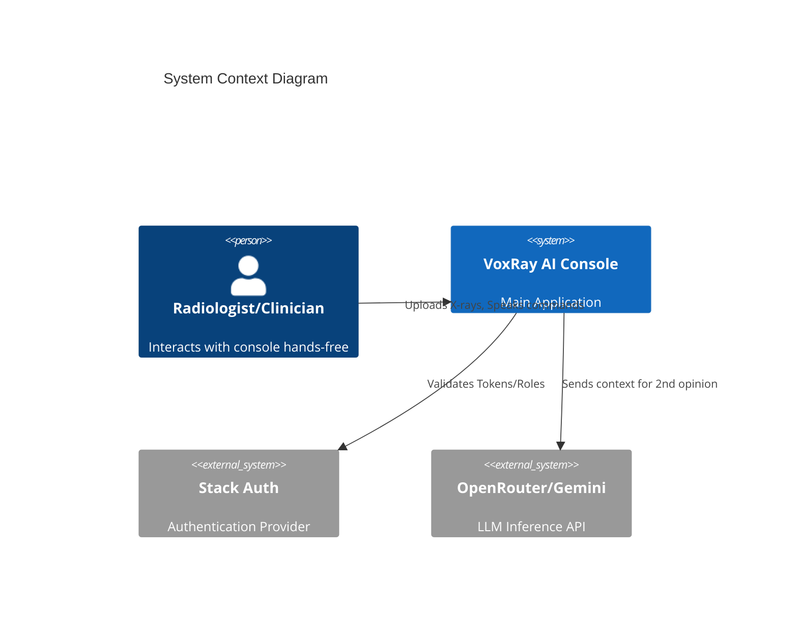

# Architecture Overview

## Introduction

VoxRay AI is designed as a modular, scalable system that decouples the frontend user experience from the intensive AI processing in the backend. The system emphasizes low-latency inference for voice/vision (using FastApi/Edge-TTS) and high-fidelity retraining (using TFX).

## System Context

## High-Level Architecture

### Components

| Component        | Purpose                                        | Technology                   |
| ---------------- | ---------------------------------------------- | ---------------------------- |
| **Frontend**     | User Interface, Audio Capture, Image Rendering | React 18, Vite, Tailwind     |
| **Backend API**  | Model Inference, Business Logic, Proxy to LLMs | FastAPI, Python 3.12         |
| **Auth Service** | Identity Provider, User Management             | Stack Auth (External SaaS)   |
| **ML Models**    | X-Ray Analysis, Speech-to-Text                 | TensorFlow (ResNet), Whisper |
| **TFX Pipeline** | Model Retraining & Validation                  | TensorFlow Extended          |

## Technology Stack

### Backend

- **Runtime**: Python 3.12
- **Framework**: FastAPI (Async)
- **ML Engine**: TensorFlow 2.x, PyTorch (for Whisper)
- **TTS Engine**: Edge-TTS (Microsoft Edge Cloud Voice)

### Frontend

- **Framework**: React 18
- **Build Tool**: Vite
- **Styling**: Tailwind CSS, Framer Motion
- **State**: React Context / Hooks

### Infrastructure

- **Development**: Local (Uvicorn/Vite)
- **ML Ops**: TFX (Local/WSL2)
